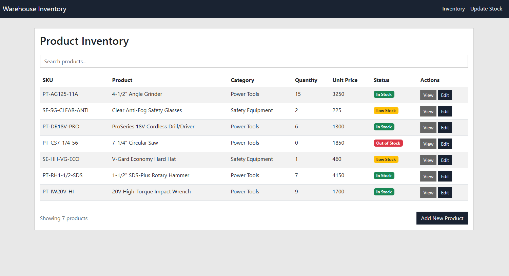

# Warehouse Inventory Management System

An application for managing warehouse inventory with a clean, professional interface. Built with vanilla JavaScript and HTML5, this application provides full CRUD operations for product management and stock tracking.


## Live Demo

Visit the live application: [https://fernandoagomezf.github.io/app_inventory_js/](https://fernandoagomezf.github.io/app_inventory_js/)

It's also a Progressive Web App so you can install it from there.




## Features

### Core Functionality
- **Product Management** - Add, edit, view, and delete products
- **Stock Tracking** - Monitor inventory levels with real-time updates
- **Stock Adjustments** - Increase or decrease inventory with transaction logging
- **Search & Filter** - Quick product search by name, SKU, or category
- **Transaction History** - Track all inventory movements per product

### Progressive Web App (PWA)
- **Installable** - Install on mobile and desktop devices
- **Offline Support** - Works without internet connection
- **Fast Loading** - Service worker caching for instant page loads
- **App-like Experience** - Runs in standalone mode

### Technical Features
- **Local Storage** - Client-side data persistence
- **Domain-Driven Design** - Clean architecture with separated concerns
- **Repository Pattern** - Data access abstraction layer
- **Responsive Design** - Mobile-first Bootstrap 5 layout
- **Professional UI** - Navy blue and neutral gray color scheme

## Architecture

The application follows a layered clean architecture pattern:

```
├── Domain Layer (domain.js)
│   ├── Product - Product entity with business logic
│   ├── Stock - Stock level management
│   └── Transaction - Inventory transaction records
│
├── Infrastructure Layer (infrastructure.js)
│   ├── ProductRepository - Product data persistence
│   ├── StockRepository - Stock data persistence
│   └── TransactionRepository - Transaction data persistence
│
├── Application Layer (application.js)
│   ├── InventoryManager - Product and stock operations
│   └── ViewState - Navigation state management
│
└── Presentation Layer (client-*.js)
    ├── client-index.js - Product listing page
    ├── client-detail.js - Product details view
    ├── client-edit.js - Product editing
    ├── client-new.js - New product creation
    └── client-update.js - Stock adjustment interface
```

## Pages

- **index.html** - Main inventory listing with search
- **detail.html** - Product details and transaction history
- **edit.html** - Edit product information
- **new.html** - Create new product
- **update.html** - Adjust stock quantities

## Design

The application features a professional, minimalist design:
- **Color Scheme**: Navy blue (#1a2332) primary, neutral grays
- **Typography**: Segoe UI font family
- **No Rounded Corners**: Clean, sharp edges throughout
- **Responsive Tables**: Bootstrap-powered responsive layouts

## Technologies

- **HTML5** - Semantic markup
- **CSS3** - Custom styling with CSS variables
- **JavaScript ES6+** - Modern JavaScript features (classes, modules, private fields)
- **Bootstrap 5.3** - Responsive UI framework
- **Service Workers** - Offline functionality
- **LocalStorage API** - Client-side data persistence

## Installation

### Option 1: Install as PWA
1. Visit [https://fernandoagomezf.github.io/app_inventory_js/](https://fernandoagomezf.github.io/app_inventory_js/)
2. Click the install button in your browser
3. Use like a native app!

### Option 2: Local Development
```bash
# Clone the repository
git clone https://github.com/fernandoagomezf/app_inventory_js.git

# Navigate to project directory
cd app_inventory_js

# Serve locally (requires Python)
python -m http.server 8000

# Or use Node.js http-server
npx http-server -p 8000

# Open browser to http://localhost:8000
```

## Data Model

### Product
```javascript
{
  id: UUID,
  sku: string,           // Unique identifier
  name: string,          // Product name
  category: string,      // Product category
  manufacturer: string,  // Manufacturer name
  description: string,   // Product description
  price: number,         // Unit price
  location: string,      // Warehouse location
  supplier: string,      // Supplier name
  weight: number,        // Weight in kg
  volume: number         // Volume in cm³
}
```

### Stock
```javascript
{
  sku: string,     // Product SKU
  quantity: number // Current quantity
}
```

### Transaction
```javascript
{
  id: UUID,
  sku: string,        // Product SKU
  quantity: number,   // Quantity changed
  price: number,      // Price at transaction time
  type: number,       // 1 (increase) or -1 (decrease)
  total: number,      // Total value
  date: string,       // Transaction timestamp
  reason: string,     // Reason for adjustment
  notes: string       // Additional notes
}
```

## Configuration

### Service Worker
The service worker caches all application resources for offline use. Cache name and version can be configured in `sw.js`:

```javascript
const CACHE_NAME = 'warehouse-inventory-v1';
```

### PWA Manifest
Customize app appearance in `manifest.json`:

```json
{
  "name": "Warehouse Inventory Management System",
  "short_name": "Inventory",
  "theme_color": "#1a2332",
  "background_color": "#1a2332"
}
```

## Browser Support

- Chrome/Edge (Desktop & Mobile)
- Firefox (Desktop & Mobile)
- Safari (Desktop & Mobile)
- Opera

## Acknowledgments

- Bootstrap team for the UI framework
- PWA Builder for icon generation tools
- GitHub Pages for hosting

